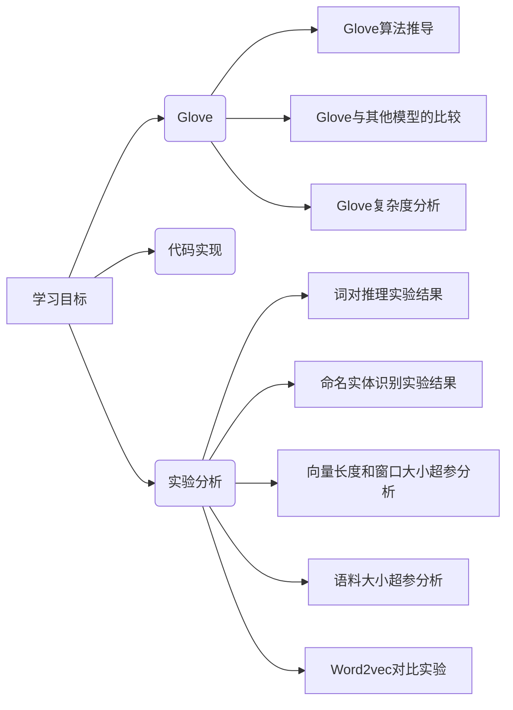

# 1. Lesson-Deepshare

**学习目标：**

## 1.1 论文导读

### 1.1.1 论文背景知识

- 矩阵分解方法
  - 构建词共现矩阵
  - 在词对推理任务上表现特别差
- 基于上下文的向量学习方法
  - Word2Vec
    - CBOW
    - Skip-Gram
  - 无法使用全局的统计信息

### 1.1.2 论文研究成果及意义

#### 【1】研究成果

- 在词对推理数据集上取得最好的结果
- 公布了一系列基于GloVe的预训练词向量

#### 【2】研究意义

- 推动了基于深度学习的自然语言处理的发展（历史意义）

## 1.2 论文精读

### 1.2.1 摘要

1. 当前词向量学习模型能够通过向量的算数计算捕捉词之间细微的语法和语义规律，但是这种规律背后的原理依旧不清楚

   > 语义： $V(king) - V(queen) = V(man) - V(woman)$ 
   >
   > 语法： $V(adv_1) - V(adj_1) = V(adv_2) - V(adj_2)$ 

2. 经过仔细分析，我们发现了一些有助于这种词向量规律的特性，并基于词提出了一种新的对数双线性回归模型，这种模型能够利用全局矩阵分解和局部上下文的优点来学习词向量

3. 我们的模型通过只在共现矩阵中的非0位置训练达到高效训练的目的

4. 我们的模型在词对推理任务上得到了75%的准确率，并且在多个任务上得到最优结果

### 1.2.2 GloVe模型

**原理（经过观察）**：我们可以使用一些词来描述一个词，比如我们使用 $冰块$ 和 $蒸汽$ 来描述 $固体$、$气体$、$水$ 和 $时尚$ 四个词。

- 与 $冰块$ 接近，并且和 $蒸汽$ 不接近：$固体$，并且概率比值很大
- 与 $蒸汽$ 接近，并且和 $冰块$ 不接近：$气体$，并且概率比值很小
- 与 $冰块$ 和蒸汽都不接近：$水$ 和 $时尚$，并且概率比值不大不小

**结论**：共现矩阵的概率比值可以用来区分词

**公式推导：**

$$
F(w_i,w_j,\tilde{w_k}) = \frac{P_{ik}}{P_{jk}}\tag{1.1}
$$

$F(w_i,w_j,\tilde{w_k}) = \frac{P_{ik}}{P_{jk}}$ 考验了 $i,j,k$ 三个词两两之间的相似关系，基于cossimilarity的定律，三个词之间 $2pair$ 的相似关系可以表示为 $i$ 和 $j$ 之间的词向量的差值与 $k$ 的词向量的关系：
$$
F(w_i-w_j,\tilde{w_k}) = \frac{P_{ik}}{P_{jk}}\tag{1.2}
$$

因为 $\frac{P_{ik}}{P_{jk}}$ 是一个标量，而 $F$ 是作用在两个向量上的，向量转化为标量的方式可以通过 $innder-dot$ 的方式进行，因此 $F$ 的形式可以联想为：
$$
F((w_i-w_j)^{T}\tilde{w_k}) = \frac{P_{ik}}{P_{jk}}\tag{1.3}
$$

$$
F((w_i-w_j)^{T}\tilde{w_k}) = F(w_i^{T}\tilde{w_k} - w_j^T\tilde{w_k}) = \frac{P_{ik}}{P_{jk}}\tag{1.4}
$$

令 $F = \exp$ ，
$$
\begin{align}
F((w_i-w_j)^{T}\tilde{w_k}) &= F(w_i^{T}\tilde{w_k} - w_j^T\tilde{w_k})\\
&=\exp{(w_i^{T}\tilde{w_k} - w_j^T\tilde{w_k})}\\
&=\frac{\exp{(w_i^{T}\tilde{w_k})}}{\exp{(w_j^T\tilde{w_k})}}\\
&=\frac{P_{ik}}{P_{jk}}
\end{align}
$$

现在只需要让分子能与分子对应，分母能与分母对应即可：
$$
\begin{align}
&\exp{(w_i^Tw_k)}  = P_{ik} = \frac{X_{ik}}{X_i}\\
&\exp{(w_j^Tw_k)} = P_{jk}
\end{align} \tag{1.5}
$$

$$
\exp{(w_i^T \tilde{w_k})} = P_{ik} \space \Rightarrow \space  w_i^T\tilde{w_k} = \log{(X_{ik})} - \log{(X_i)} \tag{1.6}
$$

因为 $w_i^T\tilde{w_k} = \tilde{w_k}w_i^T$ ，但是 $\log{(X_{ik})} - \log{(X_i)} \ne \log{(X_i)} - \log{(X_{ik})}$ ，并且 $\log{(X_i)}$ 和 $k$ 无关，为了解决对称性的问题，模型引入两个 $bias$，$b_i$ 和 $b_k$ ：

$$
\log{(X_{ik})} = w_i^T\tilde{w_k} + b_i + b_k \tag{1.7}
$$

因为 $\log{(X_{ik})} = \log{(X_{ki})}$ ，但是 $w_i^T\tilde{w_k} + b_i \ne w_k^T\tilde{w_i} + b_k$ ，

所以：$w_i^T\tilde{w_k} + b_i + b_j = \log{(X_{ik})}$ 
$$
J = \sum_{i, j = 1}^V f(X_{ij})(w_i^T\tilde{w_j} + b_i + b_j - \log{(X_{ij})})^2 \tag{1.4}
$$

- 原理：词对出现次数越多，那么这两个词在loss函数中的影响越大
- $f(X_{ij})$ 需要满足：
  - $X_{ij} = 0$ 时，$f(X_{ij}) = 0$：表示没有共现过的权重为0，不参加训练
  - 非减函数，因为共现次数越多，权重越大
  - $f(X_{ij})$ 不能无限制的大，防止 $is$ 、$are$ 、 $the$ 的影响。

$$
f(x) = \left\{\begin{matrix}
(x/x_{max})^\alpha   & if \space x < x_{max}\\
1  & otherwise
\end{matrix}\right. \tag{1.5}
$$

### 1.2.3 实验结果与分析

在词对推理数据集上取得最好的结果

多个词相似度任务上取得最好的结果

命名实体识别实验结果

### 1.2.4 论文总结

